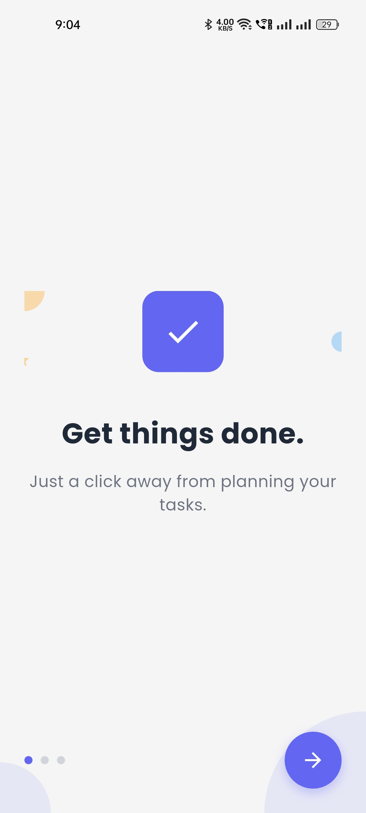
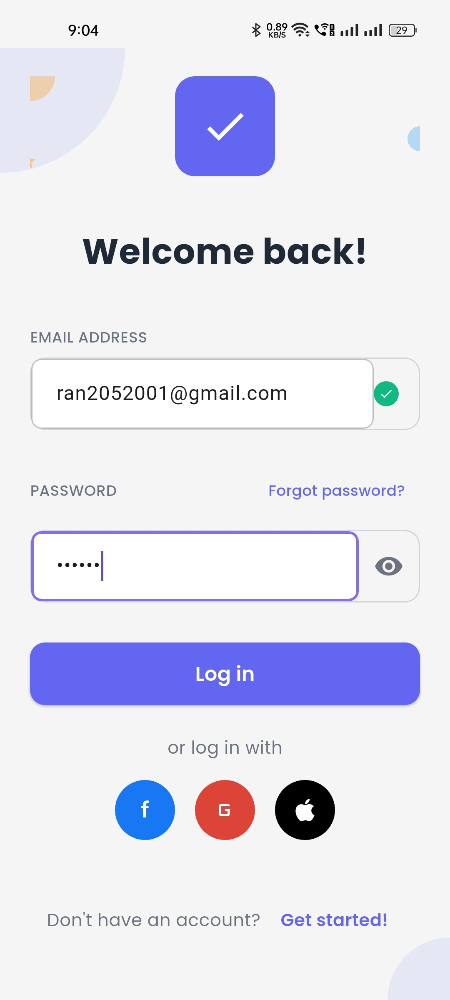
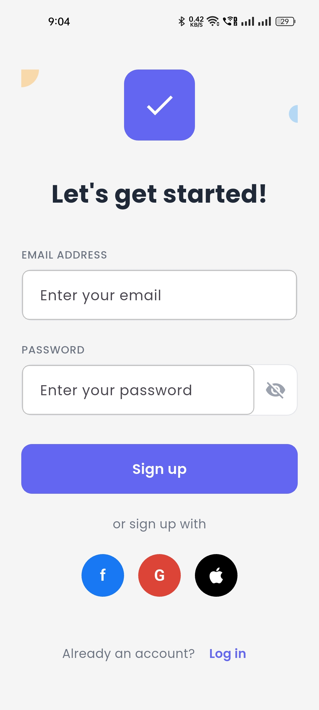
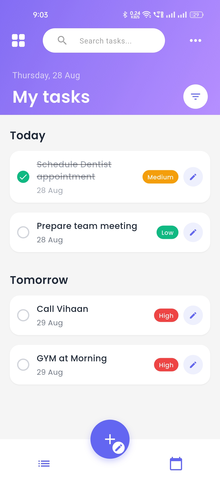
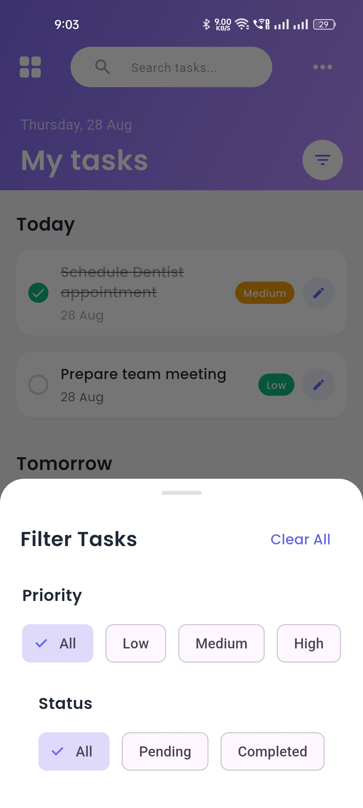
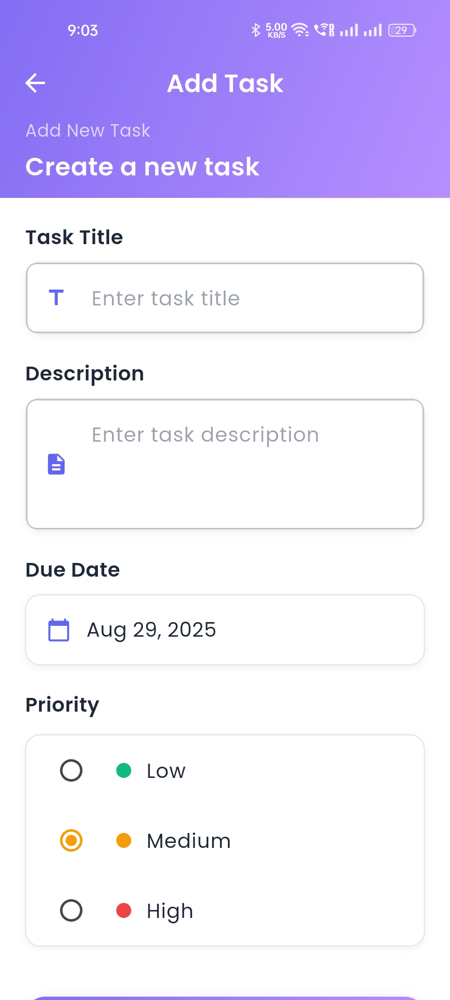

# Task Management App

A modern Flutter task management application built with clean architecture and BLoC pattern for state management. This app allows workers to efficiently manage their tasks with features like authentication, task creation, editing, and filtering.

<div style="display: flex; justify-content: space-between;">
    
    
    
</div>
<div style="display: flex; justify-content: space-between;">
    
    
    
</div>


## Download APK

### Direct Download
You can download the latest APK directly from the repository:

📱 **[Download APK](assets/app.apk)**


## Features

### User Authentication
- **Firebase Authentication** with email/password
- User registration and login
- Secure session management
- Error handling for invalid credentials

### Task Management
- **Create, Edit, Delete, and View** tasks
- **Task Fields**: Title, Description, Due Date, Priority (Low/Medium/High)
- **Task Status**: Mark tasks as complete/incomplete
- **Real-time Updates** with Firebase Firestore

### Task Filtering & Organization
- Filter tasks by **priority** (Low, Medium, High)
- Filter tasks by **status** (Completed, Pending)
- Tasks sorted by **due date** (earliest to latest)
- Visual priority indicators with color coding

### Modern UI/UX
- **Material Design** principles
- **Responsive design** for both iOS and Android
- **Clean and intuitive** user interface
- **Consistent color scheme** and typography
- **Smooth animations** and transitions

## Architecture

This app follows **Clean Architecture** principles with the following layers:

### Project Structure
```
lib/
├── core/
│   ├── constants/          # App-wide constants
│   ├── errors/            # Error handling
│   └── services/          # Firebase services
├── views/
│   ├── auth/              # Authentication feature
│   │   ├── data/          # Data layer
│   │   ├── domain/        # Business logic
│   │   └── presentation/  # UI layer
│   └── task/              # Task management feature
│       ├── data/          # Data layer
│       ├── domain/        # Business logic
│       └── presentation/  # UI layer
└── shared/
    ├── models/            # Shared data models
    └── widgets/           # Reusable UI components
```

### Architecture Layers

1. **Presentation Layer**: UI components, BLoC state management
2. **Domain Layer**: Business logic, use cases, entities
3. **Data Layer**: Repositories, data sources, models

### State Management
- **BLoC Pattern** for predictable state management
- **Event-driven** architecture
- **Separation of concerns** between UI and business logic

## Technology Stack

- **Flutter**: Cross-platform UI framework
- **Firebase**: Backend services (Authentication, Firestore)
- **BLoC**: State management
- **Equatable**: Value equality
- **Google Fonts**: Typography
- **Intl**: Internationalization and date formatting

## Getting Started

### Prerequisites

- Flutter SDK (3.2.3 or higher)
- Dart SDK
- Android Studio / VS Code
- Firebase project

### Installation

1. **Clone the repository**
   ```bash
   git clone <repository-url>
   cd task_management_app
   ```

2. **Install dependencies**
   ```bash
   flutter pub get
   ```

3. **Firebase Setup**
   
   a. Create a new Firebase project at [Firebase Console](https://console.firebase.google.com/)
   
   b. Enable Authentication with Email/Password provider
   
   c. Create a Firestore database
   
   d. Download `google-services.json` (Android) and `GoogleService-Info.plist` (iOS)
   
   e. Place the configuration files in the appropriate directories:
      - Android: `android/app/google-services.json`
      - iOS: `ios/Runner/GoogleService-Info.plist`

4. **Run the app**
   ```bash
   flutter run
   ```


### Note
- The APK is signed and ready for installation
- No additional setup required - just install and use
- All features are fully functional in the APK version

```

## Usage

### Authentication
1. **Register**: Create a new account with email and password
2. **Login**: Sign in with your credentials
3. **Logout**: Use the logout button in the app bar

### Task Management
1. **Create Task**: Tap the floating action button (+)
2. **Edit Task**: Tap on any task to edit
3. **Complete Task**: Use the checkbox to mark as complete
4. **Delete Task**: Use the delete option in task actions
5. **Filter Tasks**: Use the filter button to sort by priority/status

## Key Features Implementation

### Authentication Flow
- Firebase Authentication integration
- Secure user session management
- Error handling for authentication failures
- Automatic navigation based on auth state

### Task CRUD Operations
- **Create**: Add new tasks with all required fields
- **Read**: Display tasks in a clean list format
- **Update**: Edit existing tasks
- **Delete**: Remove tasks with confirmation

### UI Components
- **CustomButton**: Reusable button component with loading states
- **CustomTextField**: Form input component with validation
- **TaskCard**: Task display component with priority indicators
- **PriorityChip**: Visual priority indicator

### Data Management
- **Firestore Integration**: Real-time database
- **Offline Support**: Firebase handles offline data sync
- **Data Validation**: Client-side and server-side validation
- **Error Handling**: Comprehensive error management

## Contributing

1. Fork the repository
2. Create a feature branch
3. Make your changes
4. Add tests if applicable
5. Submit a pull request

## License

This project is licensed under the MIT License - see the LICENSE file for details.

## Support

For support and questions, please open an issue in the repository.

---

**Built with ❤️ using Flutter and Firebase**
